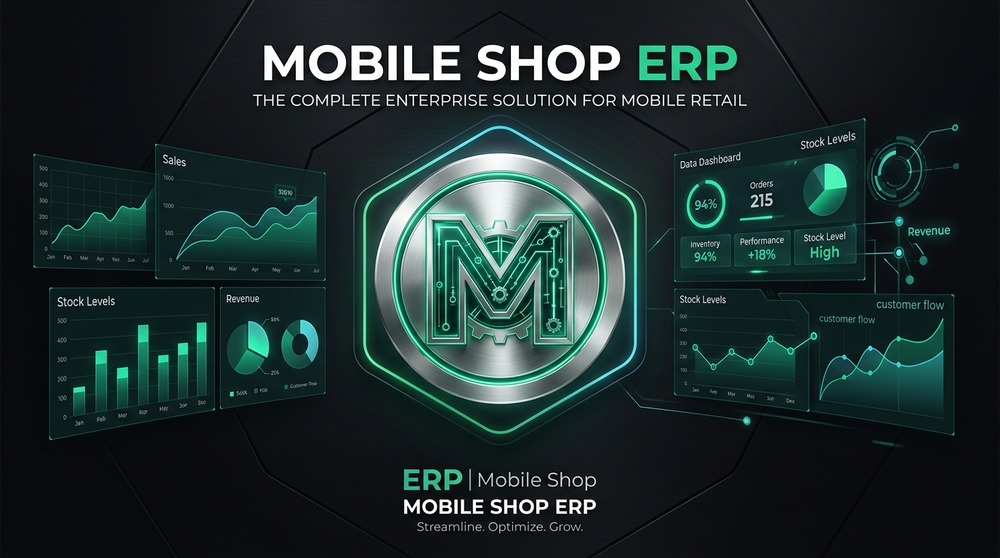

<div align="center">
  

  # Mobile Shop ERP
  **Next-Gen Local Desktop ERP for Retail Smartphone & Electronics Stores**

  [](https://github.com/saadkhan2003/MobileShopERP/releases)
  [](https://github.com/saadkhan2003/MobileShopERP/releases)
  [](#)
</div>

A high-performance local desktop application for retail mobile phone and accessories businesses. The backend is Rust with embedded SQLite. The interface is React and TypeScript inside Tauri 2. It does not run an external HTTP server or require an internet connection for shop operations.

The shared Button, Card, PageHeader, Table, Input, Label and Badge components and the base visual tokens were adapted from the owner's [PharmaCare](https://github.com/saadkhan2003/PharmaCare) repository. Navigation and shop workflows are built for this application.

The sidebar groups shop modules by workflow and toggles between a 256px menu and a 64px icon rail, matching PharmaCare's desktop layout. Its width preference persists locally; icons remain labeled for keyboard and assistive technology users. Product, customer, supplier, technician, IMEI, ledger contact, and credit sale pickers support keyboard and text search. Phone product and purchase details appear in guided cards with subtle motion; the animation respects the system reduced-motion setting.

Owners can edit Global settings to set the shop name, tagline, logo, phone, address, and receipt footer. The default name and tagline are Mobile Shop and Desktop ERP. The identity is stored in SQLite, included in database backups, and appears in the sidebar, sign-in screen, printed invoices, and product labels. Logo uploads accept PNG, JPEG, or WebP files up to 1 MB.

## Install and run

Linux development prerequisites: Rust, Node.js, GTK 3, WebKit2GTK 4.1, and libsoup 3. On this machine they are installed.

```bash
npm install
npm run desktop
```

To build an installable Linux package:

```bash
npm run tauri -- build --bundles deb
```

The resulting `.deb` is in `src-tauri/target/release/bundle/deb/`. Launch the installed app from the desktop menu. On first launch, create the owner account with a password of at least eight characters. Shop data is stored by Tauri in the operating system's application data directory under `com.mobileshop.erp`.

Signed desktop packages are published in this repository's [GitHub Releases](https://github.com/saadkhan2003/MobileShopERP/releases/latest). Each installed package type checks the matching signed updater asset: AppImage or Debian package on Linux, NSIS setup `.exe` or MSI on Windows, and the application bundle on macOS. macOS users download a `.dmg`; its updater installs the signed `.app.tar.gz` built from that app. The desktop checks for updates when the shop opens, every 30 minutes, and when the window regains focus. Available updates appear in a banner above the current module. Releases marked critical install automatically and block shop operations until installation succeeds.

The [desktop build workflow](.github/workflows/desktop-builds.yml) runs the tests, then builds Linux `.deb` and `.AppImage`, Windows NSIS `.exe` and MSI, and macOS `.dmg` files for Apple Silicon and Intel. Download CI builds from the workflow run's artifacts. These CI artifacts are build checks and are not configured for in-app updates; signed updater releases are produced with the [release workflow](.github/workflows/publish-desktop-release.yml) described in the [release process](docs/RELEASE.md).

## Shop workflows

- Products for phones, chargers, cables, glass protectors, covers, power banks, watches, memory cards and spare parts; SKUs, barcodes, compatibility, prices and reorder alerts for both phones and accessories.
- Individual phone inventory with unique IMEI, PTA status, condition checklist, box/charger details, supplier and cost. Receive multiple products on one purchase, with each phone's IMEI entered individually. Buy used phones and accept trade-ins.
- Sales with selected phone IMEI, accessory quantities, split initial payments, discounts, minimum price checks, credit balances, printable invoices and one-click PDF export. A scanner that types a barcode or SKU can select products in checkout. Product labels render a scannable Code 128 barcode when a barcode or SKU is set.
- Manager-approved customer returns record the returned quantity, refund and reason in one transaction; update sellable stock or phone IMEI status; adjust the sale balance and installments; and appear in the audit trail and reports. Sales that include a trade-in require a separate trade-in reversal before returning, since the exchanged phone may have been resold.
- Installment scheduling and collection; customer and supplier ledgers; supplier returns and outstanding payments.
- Repair jobs with PDF job cards, status updates, spare part consumption, warranty claims, expenses, cash opening and closing, owner drawings, staff accounts, roles and audit records.
- Dashboard, date-filtered reports with revenue, category, product and staff charts, fast and slow stock, price and IMEI history, product, customer and invoice search, and a daily closing report with payment methods, refunds, expenses, expected cash and discrepancies.
- Local daily snapshots, manual backups, scheduled verified copies to a chosen external folder, backup integrity checks and restore with a safety snapshot.

The app records PTA status as entered by staff; it does not verify device status with PTA. Use **Save PDF invoice** or **Save PDF job card** to choose a PDF destination. A separate **Print invoice** button opens the system print dialog. Choose an external backup folder on another drive before enabling scheduled copies; a folder on the same disk does not protect against disk failure.

The [PDF user manual and UI-only test guide](output/pdf/MobileShopERP_User_Manual_UI_Test_Guide_v0.4.3.pdf) covers all 27 sidebar pages, connected shop workflows, sample test records, expected results, and a release sign-off sheet. Its [editable source](docs/USER_MANUAL_UI_TESTING.md) can be rendered again with `scripts/render-user-manual.py` when the app changes.

## Verification

```bash
npm test
npm run build
cargo test --manifest-path rust/Cargo.toml
cargo check --manifest-path src-tauri/Cargo.toml
```

The Rust suites cover every read screen and shop transactions; the TypeScript UI suite covers setup, login, form submission paths, barcode rendering, and all owner navigation screens. See [testing details](docs/TESTING.md).

For signed updater bundles and publishing steps, see [release instructions](docs/RELEASE.md). The update feed is hosted on GitHub Releases.

## Demo data

After creating an owner account, add repeatable sample records to the desktop database:

```bash
python3 scripts/seed-demo.py --dry-run
python3 scripts/seed-demo.py
sqlite3 -readonly "$HOME/.local/share/com.mobileshop.erp/shop.db" < scripts/demo-check.sql
```

The seed uses [demo-seed.sql](scripts/demo-seed.sql), leaves existing records intact, and writes a safety backup before changing the database. Run the seed again without creating duplicates. In the running app, click **Refresh** or reopen a section to load the new records.

## Scope notes

The source PDF describes cloud sync, remote owner dashboards, WhatsApp or SMS sending, and branch-wide synchronization as optional or future features. This release is an offline desktop app. Branch records exist, but stock and cash are managed by one local database; there is no cross-computer synchronization. WhatsApp and SMS messages are not sent automatically. Confirm shop name, receipt header, tax handling and backup destination before production use.

The prior web and Electron prototype is retained under `legacy-web/` for reference; it is not used by the desktop build.
